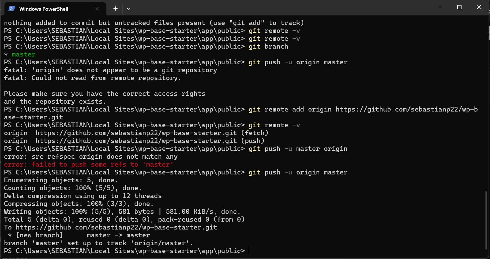
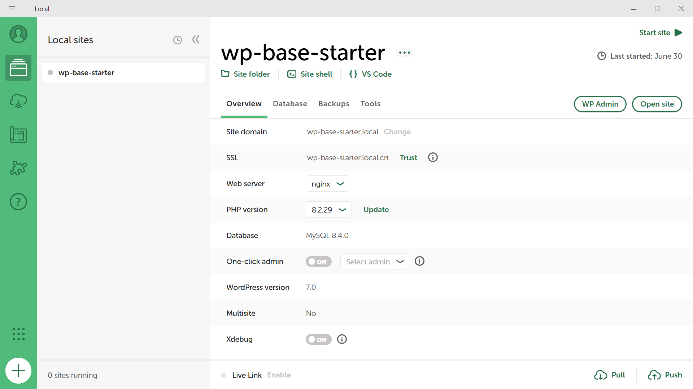

# Proyecto 1 – Base Local de WordPress

## Resumen

Instalación base de WordPress en entorno local usando LocalWP, pensada como plantilla inicial para futuros sitios vendibles para clientes.

## Objetivos

- Practicar una instalación limpia y profesional de WordPress en local.
- Definir qué se versiona (código, docs) y qué se excluye (uploads, config sensible).
- Crear un repositorio GitHub documentado que sirva como punto de partida para otros proyectos.

## Stack técnico

- Entorno local: LocalWP
- CMS: WordPress (instalación estándar)
- Servidor web: Nginx/Apache (según configuración de LocalWP)
- Base de datos: MySQL/MariaDB
- Control de versiones: Git + GitHub

## Estructura del proyecto

El repositorio Git se inicializa en la carpeta `app/public`, donde vive la instalación de WordPress:

- `wp-admin` – archivos del panel de administración (core de WordPress).
- `wp-includes` – archivos del núcleo de WordPress (no se modifican).
- `wp-content` – temas, plugins y subidas. Aquí irá tu código y personalizaciones.
- `.gitignore` – configurado para excluir `wp-config.php`, `wp-content/uploads` y cachés.

## Cómo reproducir el entorno

1. Instalar LocalWP en el equipo.
2. Crear un sitio nuevo (por ejemplo, `wp-base-starter`).
3. Abrir la carpeta `app/public` del sitio.
4. Inicializar Git y copiar este README y `.gitignore`.
5. Configurar el remoto `origin` apuntando al repositorio de GitHub correspondiente.

## Capturas

## Notas de Git y GitHub

Este proyecto se desarrolla en local (carpeta `app/public`) y se publica en GitHub:

- El repositorio Git se inicializa en `app/public` (donde vive WordPress).
- El remoto `origin` apunta a `https://github.com/sebastianp22/wp-base-starter`.
- La rama principal utilizada es `master` (según configuración actual).

**Problema común:**
Al principio, el repo local estaba creado pero no aparecía en GitHub porque:

- No se había configurado el remoto, o
- Se estaba empujando a una rama distinta de la que se visualizaba (`main` vs `master`).

**Solución:**
Configurar correctamente el remoto y hacer `git push -u origin master` tras crear los commits.

## Limitaciones y mejoras futuras

- Instalación sin plugins ni temas personalizados (solo WordPress base).
- No incluye configuración específica de rendimiento, SEO ni seguridad.
- Próximos pasos:
  - Definir un tema hijo base para proyectos de clientes.
  - Documentar un set mínimo de plugins recomendados.
  - Añadir flujo de exportación/migración a hosting real.

## Estado del proyecto

- Estado: Completado (base lista para reutilizar en otros proyectos)
- Última actualización: 2026-07-04
- Uso recomendado: clonar este entorno como punto de partida para nuevos sitios WordPress.
